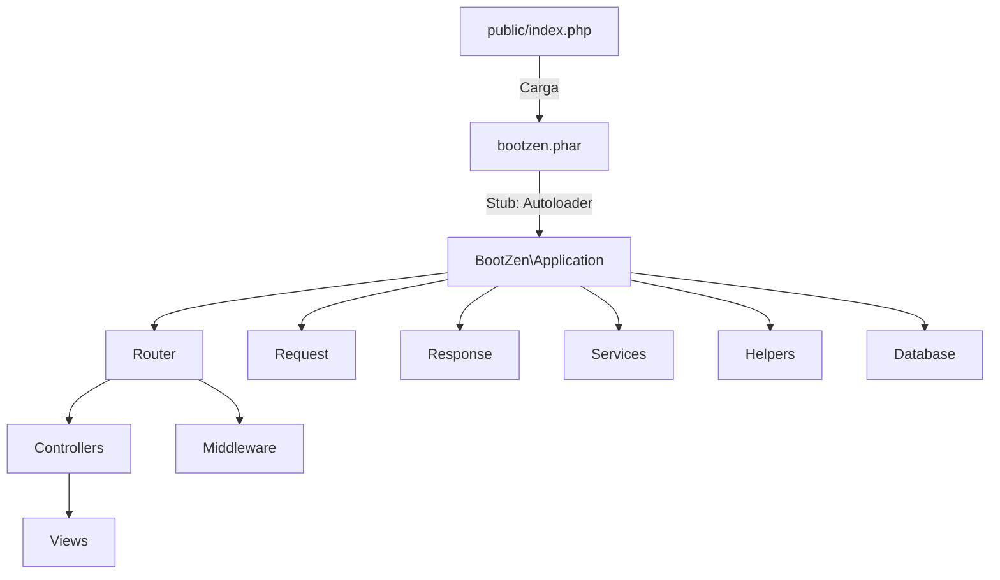

# Arquitectura BootZen Framework

## Visión General

BootZen es un microframework PHP modular, distribuido como un archivo `.phar` versionado para facilitar la instalación, actualización y portabilidad. Su arquitectura está pensada para proyectos monolíticos y modulares, con enfoque en buenas prácticas, extensibilidad y automatización.

---

## Diagrama de Arquitectura



---

## Ejemplo: Crear un sitio web simple

1. Instala BootZen y genera tu proyecto:

   ```bash
   init_project.sh MiSitioWeb
   cd MiSitioWeb
   php -S localhost:8000 -t public
   ```

2. Crea un controlador en `src/Controllers/HomeController.php`:

   ```php
   <?php
   namespace BootZen\Controllers;

   class HomeController {
     public static function register($router) {
       $router->get('/', function() {
         return '<h1>Bienvenido a BootZen</h1>';
       });
     }
   }
   ```

3. Accede a `http://localhost:8000/` y verás tu sitio funcionando.

---

## Ejemplo: API REST sencilla

1. Agrega un controlador de API en `src/Controllers/ApiRoutes.php`:

   ```php
   <?php
   namespace BootZen\Controllers;

   class ApiRoutes {
     public static function register($router) {
       $router->get('/api/hello', function() {
         return json_encode(['message' => 'Hola desde la API BootZen']);
       });
     }
   }
   ```

2. Accede a `http://localhost:8000/api/hello` y obtendrás:
   ```json
   { "message": "Hola desde la API BootZen" }
   ```

---

## Filosofía

- **Simple:** Crea sitios y APIs sin dependencias externas ni configuraciones complejas.
- **Modular:** Estructura clara y extensible.
- **Portable:** El framework se distribuye como un solo archivo `.phar`.
- **Sin complicaciones:** El flujo de desarrollo es directo y sin fricción.

---

## Estructura de Carpetas

```
public/           # Archivos públicos, index.php, assets, bootzen.phar
src/
  Controllers/    # Controladores HTTP y API
  Models/         # Modelos de datos
  Views/          # Vistas PHP
  Services/       # Servicios de negocio
  Database/
    Migrations/   # Migraciones de base de datos
    Seeders/      # Datos de ejemplo
  Core/           # Núcleo del framework (Application, Router, Request, Response, etc.)
  Middleware/     # Middlewares HTTP
  Helpers/        # Funciones auxiliares
config/           # Configuración global
views/            # Layouts, componentes y páginas
storage/          # Logs, caché, uploads
.vscode/          # Configuración recomendada para VSCode
.scripts/         # Scripts auxiliares
resources/        # CSS, JS
```

---

## Componentes Principales

- **Application**: Orquesta el ciclo de vida de la app, gestiona dependencias y el router.
- **Router**: Resuelve rutas y despacha controladores.
- **Request/Response**: Abstracción de la petición y respuesta HTTP.
- **Controllers**: Definen la lógica de endpoints y vistas.
- **Middleware**: Permite lógica antes/después de la petición (CORS, autenticación, etc).
- **Helpers**: Funciones globales reutilizables.
- **Services**: Lógica de negocio reutilizable.
- **Database**: Migraciones y seeders para la persistencia.

---

## Flujo de Arranque

1. El archivo `public/index.php` carga el autoloader de Composer y, si existe, el archivo `bootzen.phar`.
2. El stub del `.phar` registra el autoloader para el namespace `BootZen\` y ejecuta el bootstrap principal.
3. Se instancia `Application`, se registran rutas y controladores, y se ejecuta el ciclo de vida de la app.

---

## Distribución y Actualización

- El framework se distribuye como un `.phar` versionado (ej: `bootzen-1.1.0.phar`).
- El instalador y el actualizador descargan el último `.phar` desde GitHub Releases y lo integran en cada nuevo proyecto.
- El workflow de GitHub Actions compila el `.phar` usando PHP 8.4 y lo publica automáticamente.

---

## Documentación de build-phar.php

### Propósito

Genera el archivo `.phar` versionado del framework BootZen, empaquetando el núcleo y componentes necesarios para su ejecución portable.

### Contenido y Explicación

```php
<?php

// Leer la versión desde el archivo VERSION
$version = trim(file_get_contents(__DIR__ . '/VERSION'));
$pharFile = "bootzen-$version.phar";

// Si ya existe lo borramos
if (file_exists($pharFile)) {
    unlink($pharFile);
}

// Creamos el phar
$phar = new Phar($pharFile, 0, basename($pharFile));
$phar->buildFromDirectory(__DIR__ . '/core/src');

// Definir stub
$stub = file_get_contents(__DIR__ . '/core/stub.php');
$phar->setStub($stub);

// No firmar el phar para evitar problemas de integridad al copiar/renombrar
// $phar->setSignatureAlgorithm(Phar::SHA1); // Deshabilitado

// Hacemos el phar ejecutable
chmod($pharFile, 0755);
echo "Phar generado: $pharFile\n";
```

#### Detalles

- **Versión**: El nombre del archivo `.phar` incluye la versión leída de `VERSION`.
- **buildFromDirectory**: Empaqueta todo el contenido de `core/src`.
- **Stub**: El archivo `core/stub.php` define el autoloader y el bootstrap principal.
- **Sin firma**: Se omite la firma para evitar errores al copiar/renombrar el archivo.
- **Permisos**: El archivo generado es ejecutable.

---

## Recomendaciones

- No modificar el `.phar` después de generarlo.
- Usar siempre el instalador y actualizador para mantener la integridad y la versión correcta.
- El stub debe ser compatible con el autoloader y el flujo de arranque del framework.

---

## Referencias

- [Documentación oficial de Phar](https://www.php.net/manual/es/book.phar.php)
- [BootZen GitHub](https://github.com/lgzarturo/bootzen)
